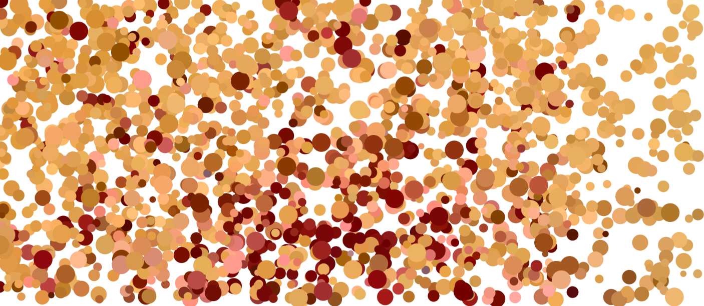

https://rawgit.com/thomasthomsen16/mini_ex_all/master/mini_ex6/empty-example/index.html

My work takes inspiration from an art style/technique called pointillism, where small dots or circles of color are applied to form an image. I wanted to combine this technique with a piece of code, that could combine two preselected paintings, here my two favourite paintings “A Bigger Splash” by David Hockney and “This Leprous Brightness” by Imran Quereshi, into an entirely new painting. I choose the two pictures not just because they are my favorite ones, but also because they are two very different paintings: Their primary colors differ, the style, message, one painter is from England the other from Pakistan and so. By combing these two painting into a new generative art work, I hoped to create a new style of paintings assisted by the computer.
   However, there were some troubles: The for-loop in line 39 doesn’t work as planned. It should be shifting between grabbing the color (the pixel) from the paintings. It doesn’t do that. Instead, it stops when it reaches the end of the “pix” variables, which uses the get() function to grab the pixel from the paintings.

What are the rules in your generative program and describe how your program performs over time. What have been generated?

The rules for my generative program are;

1.	Pick a picture or paintings
2.	Draw a part of painting 1 using only 1 circle
3.	Draw a part of painting 2 using only 1 circle
4.	Repeat step 2 & 3 

   The program grabs a pixel from one of the paintings and draws it as circle with a random position on the canvas. The size of the circles used for drawing are mapped to the mouseX.
    The program is, as mentioned before, supposed to combine the two paintings into one. Instead, it only draws one of the paintings and the end result is there for one of the paintings drawn in pointillism style.

How does this mini-exericse help you to understand what might be generativity? (see the above - objective 3)

This mini exercise provides reflection on what generativity might be, by showcasing how one can never know, how the end or temporally result might be. You never know whether your code or your rules for the artwork produces a process that works.

Links for artwork and theory

“This Leprous Brightness” by Imran Quereshi: http://naturemorte.com/artists/imranqureshi/selectedworks/1569/

“A Bigger Splash” by David Hockney:

http://www.tate.org.uk/art/artworks/hockney-a-bigger-splash-t03254

Pointillism:
https://en.wikipedia.org/wiki/Pointillism
