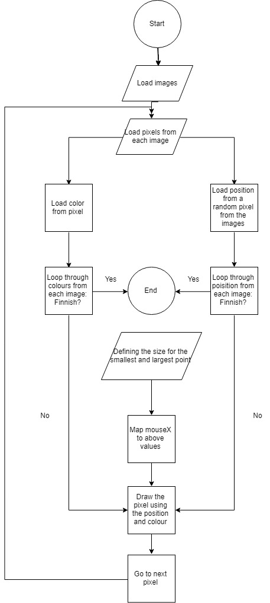

### My own flowchart for mini 6

Link to mini ex: https://github.com/thomasthomsen16/mini_ex_all/tree/master/mini_ex6

#### Thoughts on the proces

One of the things I found most difficult, and what I expect is the most difficult part of drawing any flowchart, is reducing often complex operations into abstractions, that encompasses all of these. This task can, and was for me, very difficult, since it requires thinking about code and the program in a whole new way. The focus isn’t on the technical specifications for the program in terms of code, but rather the code as a whole and how each different part of the code relates to each other. This requires breaking different parts of the code into boxes of abstractions – a sort of encapsulation.

### Group assignment: 

Group 6: Thomas Thomsen, Sille Nygaard Kock, Nanna Størup & Rasmus skov

#### Technical challenges and solutions

#### (Individual) Differences between flowchart for mini ex 6 and flowchart for group

#### (Individual) Reflections on algorithm and flowchart
