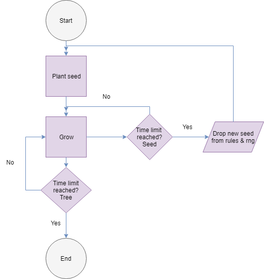
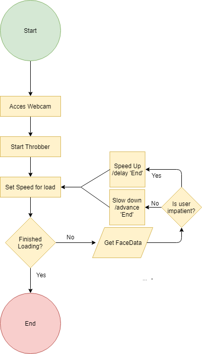

### My own flowchart for mini 6

Link to mini ex: https://github.com/thomasthomsen16/mini_ex_all/tree/master/mini_ex6

#### Thoughts on the proces

One of the things I found most difficult, and what I expect is the most difficult part of drawing any flowchart, is reducing often complex operations into abstractions, that encompasses all of these. This task can, and was for me, very difficult, since it requires thinking about code and the program in a whole new way. The focus isn’t on the technical specifications for the program in terms of code, but rather the code as a whole and how each different part of the code relates to each other. This requires breaking different parts of the code into boxes of abstractions – a sort of encapsulation.

### Group assignment: 

Group 6: Thomas Thomsen, Sille Nygaard Kock, Nanna Størup & Rasmus skov

#### Idea 1

#### Technical challenges and solutions for idea 1

One of the primary difficulties in doing this is in the aesthetic expression. Since our program deals with simulating processes seen in nature, our code will have to mimic those, so that the viewer immediately knows, that it is a process seen in nature - i.e. growth seen in trees, plants, bushes and so on. We will have to research a lot about how to code processes seen in nature. Fortunately, Daniel Shiffman has made a series of videos about this subject, that we can use as a basis for our work.
   At the same time, we will have to define a limit in how far we will go in mimicking these processes. These are highly complex and could possible fill up thousands upon thousands lines of code. We don’t have the time nor the experience for this job, so we will have to limit ourselves.
   
#### Idea 2

#### Technical challenges and solutions for idea 2

 Lastly, it’s important that we find a way to balance the penalty from being impatient and the reward for being patient. As an example: if the ‘end goal’ is instantly reached when patience is registered, the user won’t understand the impact she has on the program - same goes if the ‘end goal’ is never reached if impatuence is registered.

#### (Individual) Differences between flowchart for mini ex 6 and flowchart for group

One the obvious differences between the two flowcharts is, that the one for mini ex6 was made after finishing the code. The flowchart thereby becomes a visualization of a already existing program and helps myself and other viewers make sense of how to the program is functioning on a conceptually level.
   The flowchart for the exam done with my study group is more of thinking tool. Its role is more to visualize our ideas rather than finished code and can, and probably will, be used to pinpoint critical things about our ideas: Will this work? Were should we pay extra attention, when we code? How should the overall structure of the code be? 
    I find this difference very interesting, since I have never used nor thought of flowcharts as a tool for developing ideas. In that sense, the flowchart also become a tool for collaboration, something visual that we can all point at and reference when coming up new ideas and discussing them.

#### (Individual) Reflections on algorithm and flowchart

One very interesting way of thinking about algorithms, is to think of them as an extended mind. Algorithms is at the core of every interaction with digital artifacts today and a lot of these artifacts has unloaded some the cognitive processes with often burden ourselves with. As Ed Finn put it:

*“[…] a framing of cognition that accommodates the many ways in which it spills out of the conscious brain into the body and our surrounding social and technical environments”* – p. 37

One example of this can be seen in what one might call “the Google mind”, which has reduced the need to memorize specific things, since we can just Google it. Another example comes from the use of text-editing software, such as Microsoft Word, where the spell check algorithm helps and lessens the cognitive strain of remembering the spelling of specific words. Think of the way it automatically corrects words or underline misspellings. Algorithms has effectively changed the way we think. Finn relates this the revolution of the written word and how we produce written text: 

*“[…] our interaction with the technology of the written word not only changed the medium of thought, extending it to external papers, scrolls and other material stuff, but it also changed the mode of thought.”* – p. 38

The danger of this lies into the inherent bias that all algorithms are imbued with. Algorithms are not neutral agents, but rather a consequence of software engineers choices when designing the algorithm. The engineers themselves have certain world view and ways of thinking, that is transferred into the algorithm itself. This combined with the increasingly role for algorithms in our everyday life and digitalization can streamline the collective mode thought and cut of other ways of thinking. 

