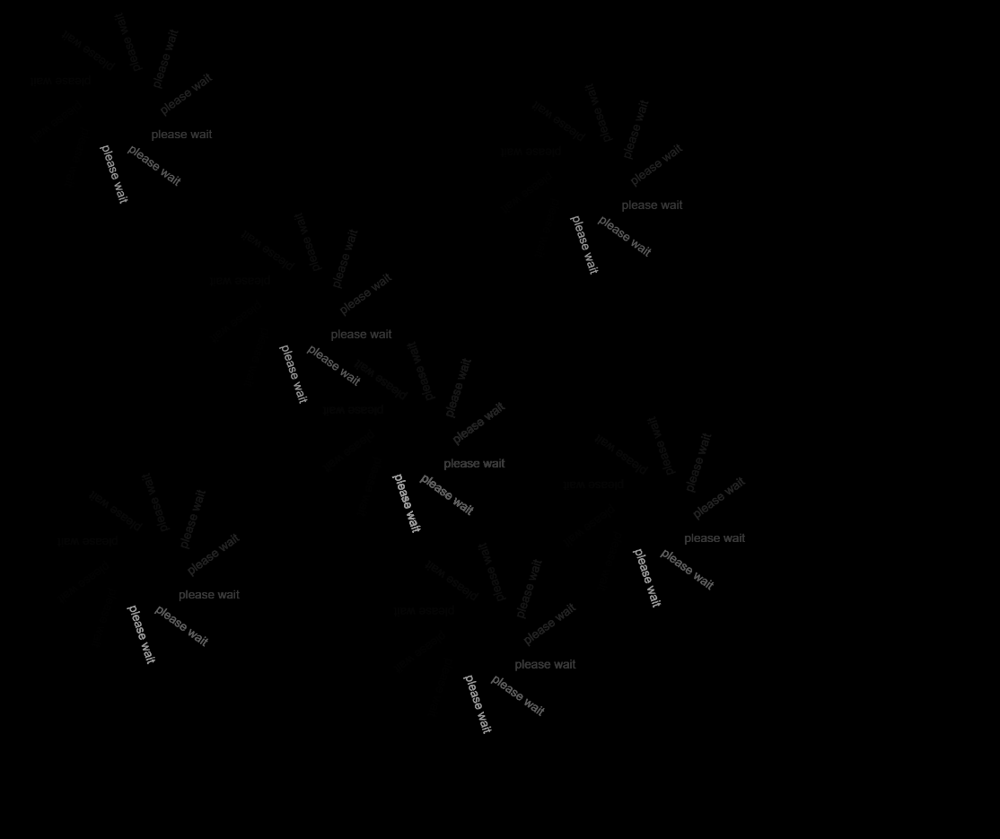

https://rawgit.com/thomasthomsen16/mini_ex_all/master/mini_ex_3/empty-example/index.html

For this program I primarily used the frameCount() in terms of time related syntax. The frameCount() essentially controls the most important aspect in the program – how fast the text is rotating (i.e. the throbber) . A higher frameCount() will make the text faster and vice versa for a lower frameCount() and thereby changing the feel of time for viewer. With a low frameCount, as I have you used, the text can be compared to something glitchy and slow moving – essentially stretching the time. Another timerelated timerelated syntax comes in the form of how the function textrot(antal,x,y) is drawn every time you press the mouse. When you are presented with a throbber and nothing happens for a while, we often sort to press the mouse or another key on the keyboard in frustation - we think that we can force the system to work faster. In that sense, the extra throbbers becomes a representation of your own impacience.
    A throbber, for me, does two things. First of all, it shows or tells that some kind of process I going on in the background – the program is loading your request, finding the piece of information you’ve searched for and so. It is what we might call a signifier according to Donald Norman. In doing this, the throbber also performs a second function: It hides what is going on – obscuring the process from the viewer. When we’re presented with a throbber, we know that something is going on, but not what it is and how it works – one might even call it obfuscation. In the light of this, we might begin to think the throbber as something that hides and obscures instead of merely being a loading object.
